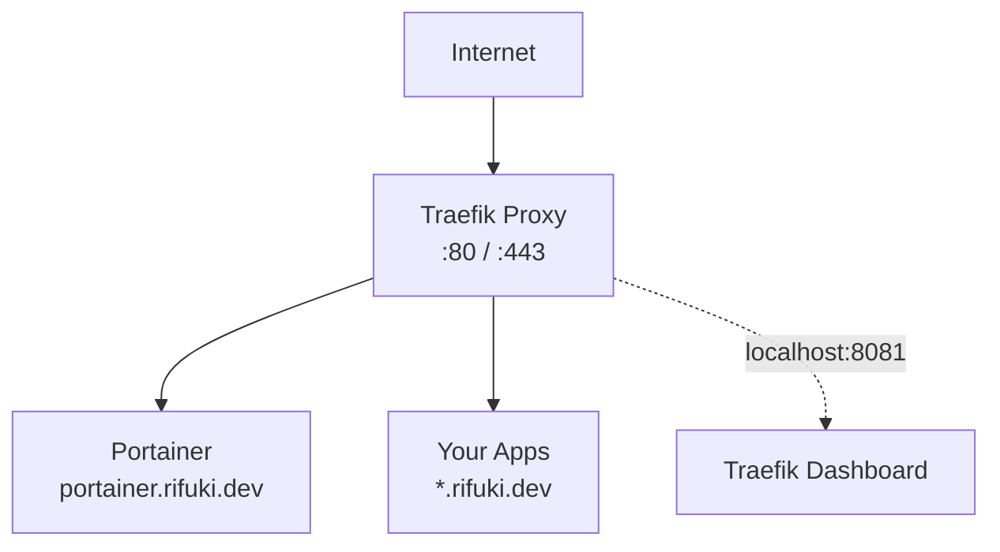

# infra

VPS infrastructure — Traefik + Portainer.

## Setup

```bash
curl -fsSL https://raw.githubusercontent.com/rifuki/infra/main/setup.sh | bash
```

## Architecture



## Services

| Service            | URL                                       |
|--------------------|-------------------------------------------|
| Traefik (proxy)    | `:80` / `:443` — automatic routing        |
| Traefik (dashboard)| `http://localhost:8081` via SSH tunnel    |
| Portainer          | `https://portainer.rifuki.dev`            |

## Structure

```
infra/
├── docker-compose.yaml  # Traefik + Portainer
├── traefik.yaml         # Traefik static config
└── setup.sh             # One-command bootstrap
```

## Deploy New Project

```bash
# 1. DNS: add A record → VPS IP
# 2. VPS: clone project and setup .env
git clone https://github.com/rifuki/<project> ~/apps/<project>
cd ~/apps/<project>
cp <service>/.env.example <service>/.env && vim <service>/.env
docker compose up -d
```
